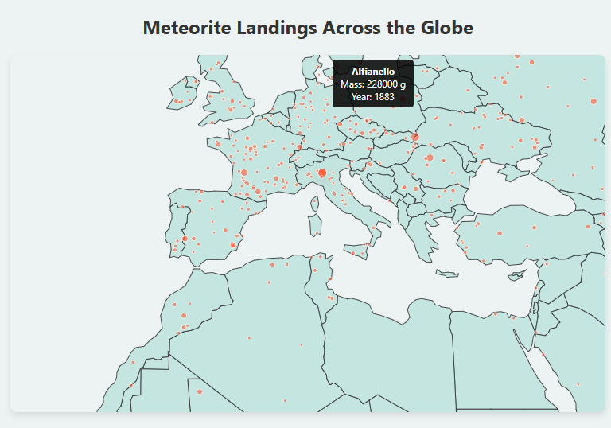

# 🌍 Meteorite Landings Map

   

---
## Overview
An **interactive, responsive world map** that visualizes meteorite landings across the globe. Built with **D3.js** and **TopoJSON**, users can pan, zoom, and hover over meteorite locations to view detailed information.

---

## Features
- Fully **responsive** layout adapting to any screen size.  
- **Zoom and pan** functionality for easy exploration.  
- Interactive **meteorite circles** with tooltips showing:
  - Name  
  - Mass  
  - Year of fall  
- Smooth hover effects with subtle opacity and shadow changes.  
- Modern design with rounded map corners, shadows, and a clean color palette.

---
## ScreenShot


---
## Technologies Used
- **D3.js v7** – Data visualization  
- **TopoJSON** – Efficient geographic data handling  
- **HTML5 & CSS3** – Structure and styling  
- **JavaScript (ES6)** – Interactivity and dynamic updates  

---
## Live Demo
View the live map here:  
[Live Demo]()

---

## Usage
1. Clone or download the repository:  
```bash
git clone https://github.com/Stabat47/meteorite-landings.git
```
2. Open index.html in your browser
3. Use mouse or touch to pan and zoom
4. Hover over meteorite circles to see detailed information
---
## Project structure
```bash
│
├── index.html       # Main HTML file
├── styles.css       # CSS styling
└── script.js        # D3.js logic for map, zoom, and tooltip
```
---
## License
This projecct is **MIT Licensed** Feel free to use and Modify

---
## Author
**Landoh Clansy** [Stabat47](github.com/Stabat47)